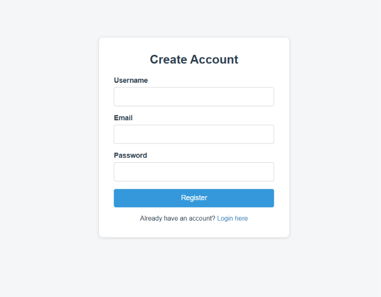
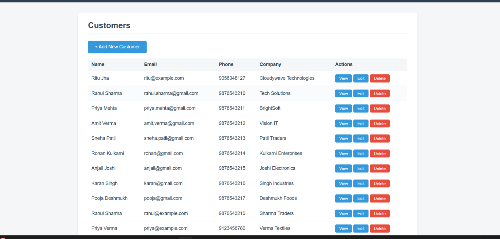
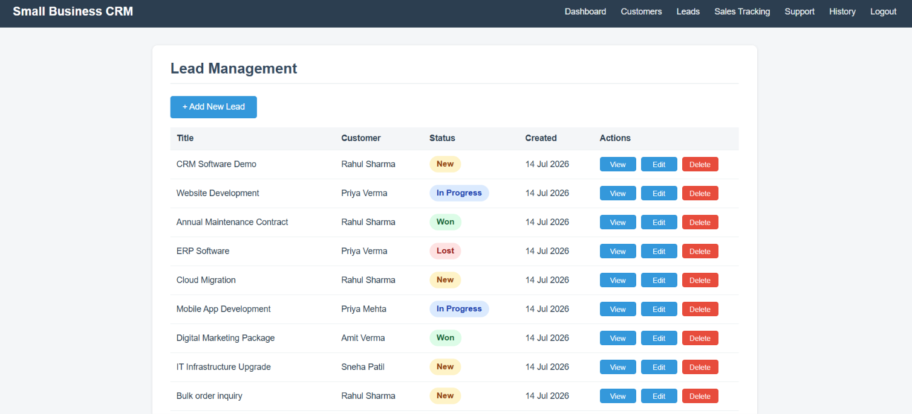
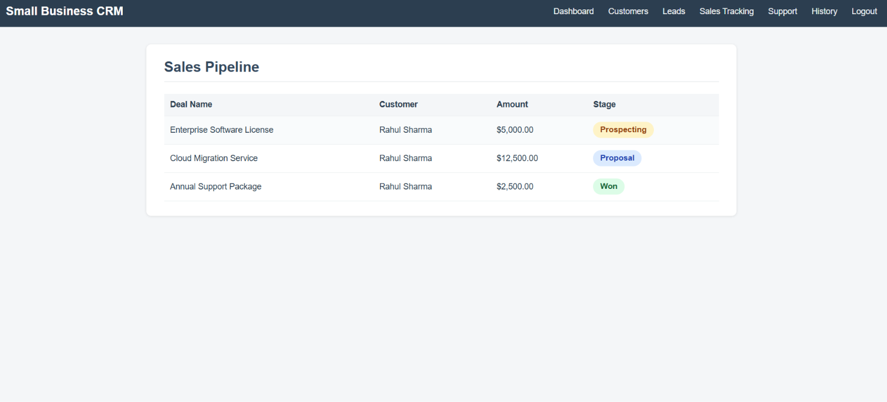

# SIMPLE CRM - ACADEMIC PROJECT

A simple **Customer Relationship Management (CRM)** web application developed as an academic project using **Core PHP**, **MySQL**, **HTML**, and **CSS**. The system helps small businesses manage customers, leads, sales records, customer support tickets, and communication history through a clean and user-friendly interface.

**Tech Stack:** HTML, CSS, PHP (mysqli - Procedural), MySQL

---

# FEATURES

- Secure User Registration & Login
- Session-Based Authentication
- Customer Management (Add, View, Edit, Delete)
- Lead Management (Add, View, Edit, Delete)
- Sales Tracking Module
- Customer Support Ticket Module
- Communication History Module
- Dashboard with Business Statistics
- Password Hashing & Secure Authentication
- Responsive and Clean User Interface

---

# FOLDER CONTENTS

## Main Pages

1. `index.php` - User Login
2. `register.php` - Create New Account
3. `logout.php` - Logout User
4. `dashboard.php` - Dashboard Overview
5. `customers.php` - View Customers
6. `add_customer.php` - Add Customer
7. `edit_customer.php` - Edit Customer
8. `delete_customer.php` - Delete Customer
9. `view_customer.php` - View Customer Details
10. `leads.php` - View All Leads
11. `add_lead.php` - Add Lead
12. `view_lead.php` - View Lead Details
13. `edit_lead.php` - Edit Lead
14. `delete_lead.php` - Delete Lead
15. `sales.php` - Sales Tracking
16. `support.php` - Customer Support Tickets
17. `history.php` - Communication History

## Support Files

- `config.php` - Database Connection
- `auth_check.php` - Authentication & Session Management
- `navbar.php` - Shared Navigation Bar
- `style.css` - Application Styling
- `database.sql` - Database Schema & Sample Data
- `README.md` - Project Documentation

---

# HOW TO RUN

## 1. Install XAMPP / WAMP

Start:

- Apache
- MySQL

---

## 2. Copy Project Folder

Place the project inside:

**XAMPP**

```
C:\xampp\htdocs\crm-project
```

**WAMP**

```
C:\wamp64\www\crm-project
```

---

## 3. Import Database

Open:

```
http://localhost/phpmyadmin
```

Create a database named:

```
crm_db
```

Import:

```
database.sql
```

---

## 4. Configure Database

Open `config.php` and update the credentials if needed.

```php
$host = "localhost";
$user = "root";
$password = "";
$database = "crm_db";
```

---

## 5. Run the Project

Open:

```
http://localhost/crm-project/
```

---

## 6. Register & Login

- Create a new account.
- Login with your credentials.
- Access the CRM dashboard.

---

# PROJECT MODULES

## Authentication

- User Registration
- User Login
- Logout
- Session Management

## Dashboard

Displays:

- Total Customers
- Total Leads
- Total Sales
- Total Support Tickets

## Customer Management

- Add Customer
- View Customer
- Edit Customer
- Delete Customer

## Lead Management

- Add Lead
- View Lead
- Edit Lead
- Delete Lead

## Sales Tracking

- View Sales Records
- Track Sales Stage
- View Deal Amount

## Support Ticket Management

- View Customer Support Tickets
- Track Ticket Status & Priority

## Communication History

- Store Customer Calls
- Store Emails
- Store Meeting Records

---

# HOW THE PROJECT WORKS

- User authentication is implemented using PHP Sessions.
- `auth_check.php` prevents unauthorized access to protected pages.
- Database connectivity is handled using `config.php`.
- Customer, Lead, Sales, Support, and Communication modules use MySQL for data storage.
- CRUD operations are implemented for Customers and Leads.
- Passwords are securely stored using `password_hash()` and verified using `password_verify()`.
- User input is sanitized using `mysqli_real_escape_string()` and displayed safely using `htmlspecialchars()` to reduce security risks.
- Customers and Leads are connected through a foreign key (`customer_id`) with `ON DELETE CASCADE`.

---

# DATABASE TABLES

- users
- customers
- leads
- sales_tracking
- support_tickets
- communication_history

---

## 📸 Screenshots

### Login Page



### Dashboard


### Customers



### Leads




### Sales Tracking



---
# FUTURE ENHANCEMENTS

- Add Support Ticket CRUD
- Customer Search & Filtering
- Export Reports to PDF/Excel
- Email Notifications
- Role-Based Access Control (Admin/User)
- Dashboard Charts & Analytics
- Task & Follow-up Management
- Pagination

---

# AUTHOR

**Shruti Chandankar**

Final Year BCA Student

---

# LICENSE

This project is developed for educational and academic purposes only.